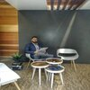

# ***Elie Kamal Al-Azar***

------------------------------------------------------------------------------------------

##  ***Personal Information ***  
 - Nationality:       Lebanese
 - Marital Status:    Single
 - Date & Birth :     August,08,1992
 - Height:            179cm
 - Weight:            85kg

 ----------------------------------------------------------------------------------------

##   ***Career Experience: *** 

- Foreign Exchange Market
2018 - Freelance EA (Expert Advisor) multiple programming developer on-going

- Assaha Trading & Supply CO SARL
2010 - Customer Service - IT Assistant - Showroom Manager on-going

- Forex Space SAL
2018 – 2019 Management Team Member

- Laser Club
2012-2016 Floor Manager

- Serious Gym
2015-2016 Certified Fitness Instructor

- “Mini B” Restaurant
2010-2012 Waiter Captain

---------------------------------------------------------------------------------------------

##  ***Qualifications *** 

#### ***Education***
- Developer Certification JavaScript Algorithms and Data Structures
FreeCodeCamp online courses ( freeCodeCamp is a donor-supported tax-exempt 501(c)(3) nonprofit
organization (United States Federal Tax Identification Number: 82-0779546)
2019-2020

- Developer Certification Responsive Web Design
FreeCodeCamp online courses ( freeCodeCamp is a donor-supported tax-exempt 501(c)(3) nonprofit
organization (United States Federal Tax Identification Number: 82-0779546)
2019-2020

- Computer Communication Engineering ( CCE ) -
AUL (Arts, Sciences and Technology University in Lebanon) Dekwaneh campus, accredited by the
European accreditation for engineering programs label ( EUR-ACE)
2015-on-going

- Third Secondary in Economics and Sociology
Lycée Moderne Libanaise, Al Haddath

#### ***Skills / Capabilities***
- #### ***Languages:***
   Mother Tongue : Arabic

   Other Languages:
    - English : Fluent
    - French : Good

#### ***Adequately capable of handeling projects that include the following programs, and skills:***

  - Microsoft Office: word, Excel and power point.
  - Adobe Photoshop CS, Visual Basic , Visual Studio( C++ )
  - Financial programming languages (EA Expert Advisor MQL4 Language).
  -  Chart analysis and data mining

-----------------------------------------------------------------------------------------------------------------

##  ***Achievments *** 

- Create programs that automatically manage accounts in financial markets ( Trading Robots)

- A member of the organizer team for the EcoLearn Summit 2019 at MEA Trainig Center

- Won multiple in-house university projects, that include robotics, designed self engineered systems,
and designing modern computer harwadres, and softwares.

- Wrote a book about the foreign exchange markets, which is being marketed across lebanon.

--------------------------------------------------------------------------------------------------------------

##  ***Hobbies *** 

Sport - Writing – Reading –Swimming

--------------------------------------------------------------------------------------------------------------

### ***Thank you for your time and consideration.***

